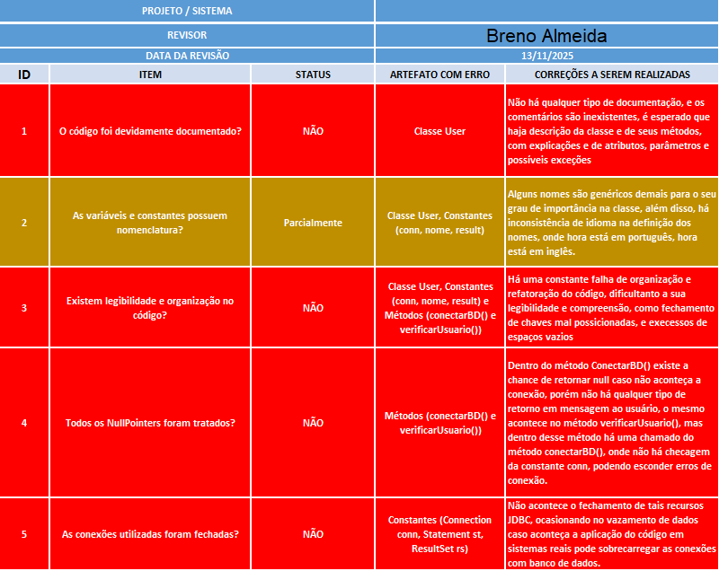
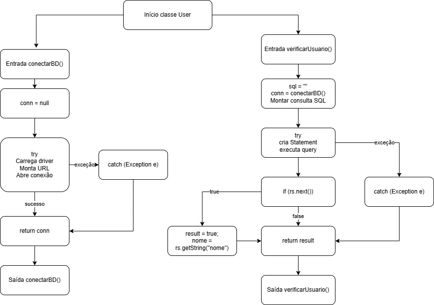
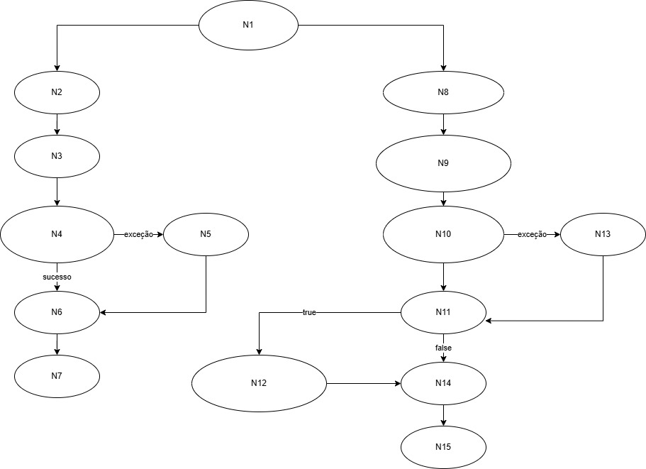

# 🧪 Teste de Caixa Branca – Classe `User` (Java)

Este projeto realiza uma análise completa de teste de caixa branca (white box testing) sobre a classe `User`, escrita em Java, responsável por duas operações fundamentais:

- Conexão com o banco de dados (`conectarBD()`)
- Verificação de credenciais de usuário (`verificarUsuario()`)

A atividade envolve:

- Revisão estática do código
- Preenchimento da planilha de teste
- Construção do fluxograma
- Construção e análise do grafo de fluxo
- Cálculo da complexidade ciclomática
- Identificação dos caminhos básicos independentes
- Criação deste README para documentação e entrega

------------------------------------------------------------------------------------

## 📁 1. Planilha de Teste de Caixa Branca Estática

A planilha preenchida se encontra no repositório.

📎 **Planilha:**

------------------------------------------------------------------------------------

## 📊 2. Fluxograma da Classe Completa

Fluxograma representando o fluxo da classe `User`:

📎 **Fluxograma:**

------------------------------------------------------------------------------------

## 🔵 3. Grafo de Fluxo de Controle (CFG)

Grafo de fluxo construído com base no fluxograma completo da classe.

📎 **Imagem do grafo:**

📎 **Arquivo XML (draw.io):**  
INSERIR-AQUI-O-ARQUIVO-XML-APÓS-O-UPLOAD

------------------------------------------------------------------------------------

## 🔢 4. Nós Identificados (Nodes)

N1  → Entrada do método conectarBD()  
N2  → conn = null  
N3  → try (carrega driver, monta URL, abre conexão)  
N4  → catch (Exception e)  
N5  → return conn  
N6  → Saída do método conectarBD()  

N7  → Entrada do método verificarUsuario()  
N8  → sql = "" / montar query / chamar conectarBD()  
N9  → try (criar Statement e executar consulta)  
N10 → if (rs.next())   [ponto de decisão]  
N11 → Bloco TRUE (result = true; nome = rs.getString("nome"))  
N12 → catch (Exception e)  
N13 → return result  
N14 → Saída do método verificarUsuario()  

------------------------------------------------------------------------------------

## 🧮 5. Complexidade Ciclomática

A complexidade ciclomática foi calculada usando a fórmula:

**M = E – N + 2P**

Onde:  
- E = número de arestas  
- N = número de nós  
- P = número de componentes conectados  

### **Resultado**

- Método `conectarBD()` → 2  
- Método `verificarUsuario()` → 3  
- **Complexidade total da classe → M = 5**

📌 São necessários **5 testes independentes** para cobrir todos os caminhos da classe.

------------------------------------------------------------------------------------

## 🛤️ 6. Caminhos Básicos (Detalhados)

### ✔ CAMINHO BÁSICO 1 – conectarBD() (fluxo normal)
N1 → N2 → N3 → N5 → N6

### ✔ CAMINHO BÁSICO 2 – conectarBD() (exceção)
N1 → N2 → N3 → N4 → N5 → N6

### ✔ CAMINHO BÁSICO 3 – verificarUsuario() (usuário encontrado)
N7 → N8 → N9 → N10(true) → N11 → N13 → N14

### ✔ CAMINHO BÁSICO 4 – verificarUsuario() (usuário não encontrado)
N7 → N8 → N9 → N10(false) → N13 → N14

### ✔ CAMINHO BÁSICO 5 – verificarUsuario() (exceção)
N7 → N8 → N9 → N12 → N13 → N14

------------------------------------------------------------------------------------

## 🗂️ 7. Caminhos Possíveis (Resumo)

CAMINHO 1 = N1 ; N2 ; N3 ; N5 ; N6  
CAMINHO 2 = N1 ; N2 ; N3 ; N4 ; N5 ; N6  
CAMINHO 3 = N7 ; N8 ; N9 ; N10(true) ; N11 ; N13 ; N14  
CAMINHO 4 = N7 ; N8 ; N9 ; N10(false) ; N13 ; N14  
CAMINHO 5 = N7 ; N8 ; N9 ; N12 ; N13 ; N14  

------------------------------------------------------------------------------------

## 📘 8. Arquivos Incluídos no Repositório

- Código fonte da classe User  
- `Planilha_TesteDeCaixaBranca.png`  
- `fluxogramaUser.jpg`  
- `grafoUser.jpg`  
- Arquivo XML contendo o grafo (após upload)  
- README completo  

------------------------------------------------------------------------------------

## 👨‍💻 Autor

**Breno Gustavo Rocha de Almeida**  
Análise e Desenvolvimento de Sistemas – FACENS
